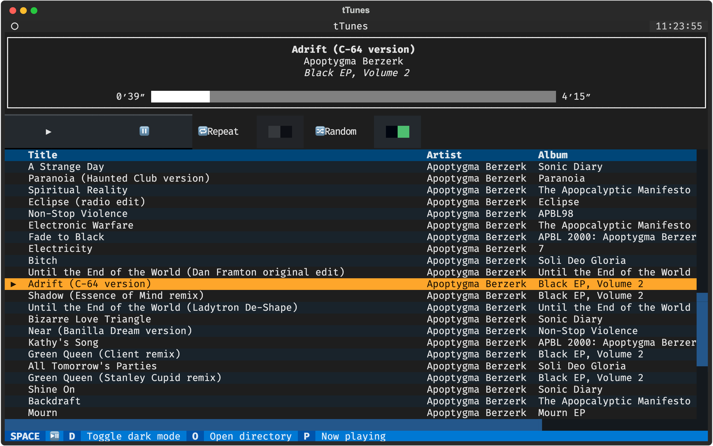
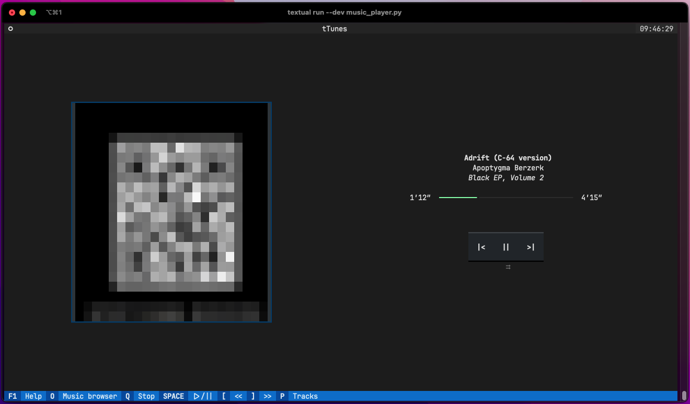
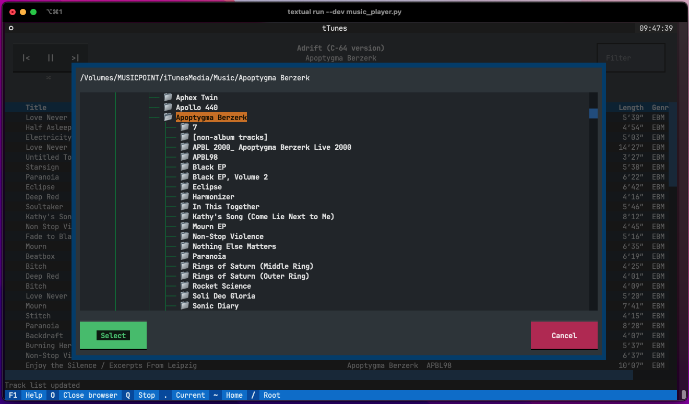
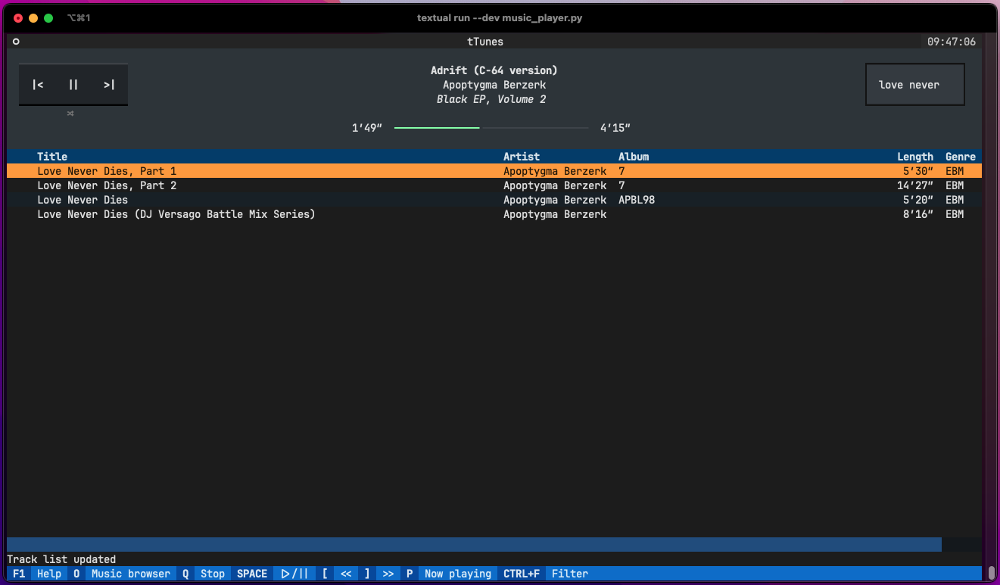

# textual-musicplayer AKA `tTunes`

A simple music player (MP3, etc.) using [Textual](https://textual.textualize.io/).

Version 0.0.1-alpha

## Screenshots

### Main TUI



### Now playing with chonky album artwork



### Source directory browser



### Playlist filtering



## Requirements

- textual - for TUI
- pygame - for music playing
- tinytag - for reading audio tags
- rich_pixel - for artwork

## Sample audio

If you have any music (currently MP3 or Ogg Vorbis) to hand, pop something into `./demo_music` to get started.

[Sample music files](https://www.soundhelix.com/audio-examples) used in the development of this app were downloaded
from [SoundHelix](https://www.soundhelix.com/). Copyright for these belongs to the appropriate artist(s).

## Basic installation (YMMV)

```bash
$ python3 -m venv ./venv
$ source venv/bin/activate
$ pip install -r requirements.txt
$ # textual console in another terminal, if you like
$ textual run --dev music_player.py
```

## Roadmap(?!)

- [x] play `.mp3`, `.ogg` music files
- [ ] add support for `.mp4`, `.m4a` and/or `.flac` files
- [x] allow the user to select the music source directory
- [x] "now playing" with chonky embedded album artwork [thanks to rich-pixels](https://github.com/darrenburns/rich-pixels)
- [ ] save session info
- [ ] drag/drop source folder?
- [ ] reimplement light/dark mode
- [ ] fix screenshots (internal)

## Notes

- If you are running this with the `textual console`, it can get a little chuggy. It seems pretty swift when running
  stand-alone.
